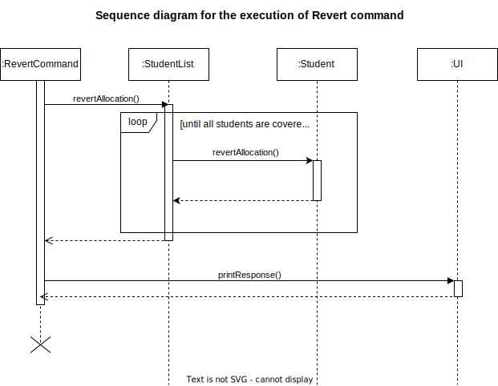
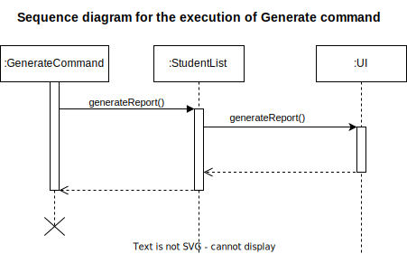
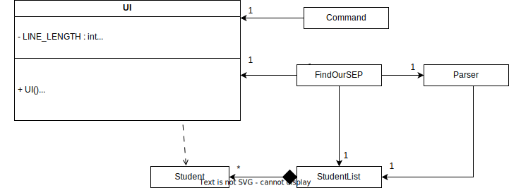
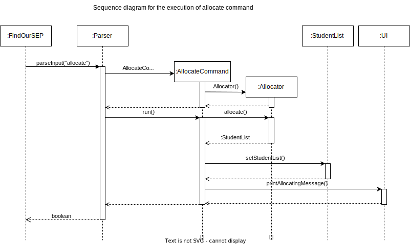

# Developer Guide

## Table of Contents
- [Acknowledgements](#Acknowledgements)
- [Installation](#Installation)
- [Design & Implementation](#design--implementation)
  - [Architecture](#architecture)
  - [Commands](#commands)
    - [Add Command](#add-command)
    - [Delete Command](#delete-command)
    - [Criteria Command](#criteria-command)
    - [Find Command](#find-command)
    - [Filter Command](#filter-command)
    - [List Command](#list-command)
    - [Stats Command](#stats-command)
    - [ViewQuota Command](#viewquota-command)
    - [Allocate Command](#allocate-command)
    - [Revert Command](#revert-command)
    - [Generate Command](#generate-command)
    - [Help Command](#help-command)
    - [Exit Command](#exit-command)
    - [Unknown Command](#unknown-command)
  - [Components](#components)
    - [Frontend / User Interface](#frontend--user-interface)
    - [Parser](#parser)
    - [Allocator](#allocator)
    - [Student](#student)
    - [StudentList](#studentlist)
    - [University and UniversityRepository](#university-and-universityrepository)
    - [FileHandler](#filehandler)
- [Product scope](#product-scope)
  * [Target user profile](#target-user-profile)
  * [Value proposition](#value-proposition)
- [User Stories](#user-stories)
- [Non-Functional Requirements](#non-functional-requirements)
- [Glossary](#glossary)
- [Instructions for Manual Testing](#instructions-for-manual-testing)


## Acknowledgements

This project utilizes the following dependencies:

- [JUnit 5.10.0](https://mvnrepository.com/artifact/org.junit.jupiter/junit-jupiter-api/5.10.0) for testing.
- [AsciiTable 0.3.2](https://mvnrepository.com/artifact/de.vandermeer/asciitable/0.3.2) for formatting tables.
- [Jackson Databind 2.18.0](https://mvnrepository.com/artifact/com.fasterxml.jackson.core/jackson-databind/2.18.0) for JSON processing.
- [OpenCSV 5.9](https://mvnrepository.com/artifact/com.opencsv/opencsv/5.9) for CSV parsing.

Many thanks to the developers and maintainers of these libraries for their incredible work. Their efforts have significantly contributed to the success of this project.

## Installation

To get started with this project, follow these steps:

### Prerequisites

- Java 17
- Download the latest `.jar` from [here](https://github.com/AY2425S1-CS2113-W12-2/tp/releases/tag/v1.0).

### Steps

1. **Copy the `.jar` file:**
    - Move the downloaded `.jar` file into a designated folder on your computer.

2. **Prepare your data file:**
    - If you want to parse a file (.CSV, .JSON, .TXT) containing student data, ensure you have the absolute path ready for that file.

3. **Run the `.jar` file:**
    - Open a terminal.
    - Navigate (`cd`) to the folder containing the `.jar` file.
    - Execute the `.jar` file using the following command:
      ```shell
      java -jar FindOurSEP.jar
      ```


🎉 Congratulations! You’re all set to dive into the wonders of this project. Enjoy the ride!

## Design & Implementation

### Architecture


### Commands

#### Add Command

Add Command adds a new student into the StudentList. Users need to provide the following information of the newly-added student so that he/she could participate in the allocation process:

* Student ID (two uppercase alphabets with 7 natural numbers between it, e.g., ``A1234567N``) 
* GPA (a valid float with a maximum of 2 decimal places, greater than 0.0 but lesser than 5.0)
* Preferences (three integers ranging from 1 to 92, representing the partner universities, enclosed in curly brackets)


You can also refer to [Parser](#parser) section to check the detailed workflow of `AddCommand`.

#### Delete Command

Delete Command removes an existing Student in the StudentList.


#### Criteria Command

Criteria Command sets a minimum GPA every student must achieve before they can be allocated to a university.


#### Find Command

The find mechanism is facilitated by `StudentList`. Every instance of `FindCommand` is created with a string `input`,
which contains the keywords for finding a student, and a `UI` instance for output handling.

The following sequence diagram shows how the find command works.


(*Sd frames from references will be shown in the `Ui` class.*)

Given below is an example usage scenario and how the find mechanism behaves at each step.

1. The user launches the application, initialising `StudentList`, which contains stored `Student` entries if any.

2. The user executes a command such as `find list A12345` or `find report B1234567I` to search for a student 
   by their ID in the StudentList. (*Note: input is case-sensitive*)

3. The command is parsed by `Parser`, which creates a `FindCommand` object with the keywords passed as 
   the input parameter.

4. The `FindCommand` constructor stores the `input` string and initialises `StudentList` and `UI` for managing 
   search and output, respectively.

5. When `run()` is called on `FindCommand`, it invokes the `findStudent()` method in `StudentList`, 
   passing `input` to find the students based on the given keywords.

6. Within `findStudent()`, the input is validated and parsed. If the format is invalid, 
   a `SEPFormatException` is thrown. An error message will be displayed informing the user.
   If the command includes `list`, the output will print a `list` format of the students found. 
   Alternatively, if the command includes `report`, the output will generate a `report` format of the students found.
   
7. If students are found, a `list` or `report` will be displayed.
   However, if no students are found, an `SEPEmptyException` is thrown. An error message will inform the user that
   no students are found.

#### Filter Command

The filter mechanism is facilitated by `StudentList`. Every instance of `FilterCommand` is created 
with a string `input`, which contains the filter criteria, and a `UI` instance for output handling.

The following sequence diagram shows how the find command works.


(*Remaining sd frames from references will be shown in the `Ui` class.*)

Given below is an example usage scenario and how the find mechanism behaves at each step.

1. The user launches the application, initialising `StudentList`, which contains stored `Student` entries if any.

2. The user executes a command such as `filter list gpa ascending` or `filter report allocated` to filter students
   by criteria based on GPA, ID, or allocation status.

3. The command is parsed by `Parser`, which creates a `FilterCommand` object with the criteria passed as
   the input parameter.

4. The `FilterCommand` constructor stores the `input` string and initialises `StudentList` and `UI` for managing
   filter and output, respectively.

5. When `run()` is called on `FilterCommand`, it invokes the `filterStudent()` method in `StudentList`,
   passing `input` to filter students based on the specified criteria.

6. Within `filterStudent()`, the input is validated and parsed. If the format is invalid,
   a `SEPFormatException` is thrown. An error message will be displayed informing the user.
   If the command includes `list`, the output will print a `list` format of the students filtered.
   Alternatively, if the command includes `report`, the output will generate a `report` format of the students filtered.

7. Depending on the filter criteria (e.g., `gpa ascending`, `id descending`, `unallocated`), 
   the appropriate method (e.g., `filterStudentGpa()`, `filterStudentId()`, or `filterByAllocationStatus()`) is invoked 
   respectively, to filter students by the specified attribute and order.

8. If students are found after the filter, a `list` or `report` will be displayed.
   However, if no students remain, an `SEPEmptyException` is thrown. An error message will inform the user that
   no students are found.

#### List Command

#### Stats Command

The `StatCommand` class implements the `stats` command, which provides GPA-related statistics (average GPA or minimum GPA) for students associated with a specified university. The command syntax is `stats <stat_type> <UNI_INDEX>`, where `<stat_type>` can be `-avggpa` for average GPA or `-mingpa` for minimum GPA.


The above sequence diagram illustrates the execution of the `stats` command, specifically the `stats -avg` example, which calculates the average GPA for students who have chosen the specified university.

* The `StatCommand` class initiates the command with the syntax `stats -avg <UNI_INDEX>`, where `-avg` indicates that the average GPA calculation is required, and `<UNI_INDEX>` specifies the target university by its index.
* `StatCommand` calls the `getUniversityByIndex()` method on `UniversityRepo`, passing the university index as an argument.
* `UniversityRepo` retrieves the `University` object corresponding to the specified index and returns it to `StatCommand`.
* After checking the `University` object is not null, `StatCommand` invokes the `calculateAverageGPAforUniversity()` method on `StudentList`, supplying the university index as an argument.
* `StudentList` calculates the average GPA for students associated with this university and returns the result as a `double` value (`avgGpa`).
* `StatCommand` then calls `printResponse()` on `UI`, passing a formatted string that includes the calculated average GPA. This response is displayed to the user with a message like "The average GPA for university <UNI_INDEX> is: <avgGpa>."

#### ViewQuota Command

The `ViewQuotaCommand` class handles the `viewQuota` command to display information about a university’s remaining quota (available spots) based on a specified university index.


The sequence diagram illustrates the execution flow of the `viewQuota` command.

* The `ViewQuotaCommand` initiates the command using a syntax like `viewQuota <UNI_INDEX>`, where `<UNI_INDEX>` specifies the university's index in the system.
* `ViewQuotaCommand` calls the `getUniversityByIndex()` method on `UniversityRepo`, passing the university index as a parameter.
* `UniversityRepo` returns the corresponding `University` object.
* With the `University` object in hand, `ViewQuotaCommand` calls `getSpotsLeft()` on the `University` object to retrieve the number of available spots (quota) for the university.
* The `University` object returns the quota as an `int` value (`spotsLeft`), representing the remaining spots.
* Next, `ViewQuotaCommand` calls `getFullName()` on the `University` object to obtain the full name of the university.
* The `University` object returns the university name as a `String` (`name`).
* Finally, `ViewQuotaCommand` calls `printResponse()` on `UI`, passing a formatted string that includes the university's index, name, and remaining quota.
* The message displayed to the user is structured as "Index: <index>, Name: <name>, Quota: <spotsLeft>," providing a summary of the requested information.

#### Allocate Command

The `AllocateCommand` class manages the allocation process of students using the `Allocator` class. This command sets up an allocation process for students in the specified `StudentList` and informs the user that allocation is underway.

You could refer to [Allocator](#allocator) section to check the detailed workflow of `AllocateCommand`.

#### Revert Command



Upon parsing a `revert` command, a `RevertCommand` instance is created. `RevertCommand` then calls the `revertAllocation()`
method in `StudentList`, which loops through all the students in the `students` array list. The method `revertAllocation()`
within the `Student` objects resets the allocation status and allocated university. The operation is completed by calling
the `UI` to print the templated response from the `Messages` enum.

#### Generate Command



The `generate` command is calls the `generateReport()` method in `StudentList`, which then calls the `generateReport()`
in the `UI` using the student array list, which prints an ASCII table representing the allocation outcome.

#### Help Command

- The help command provides users with a comprehensive guide to all the commands that the program can recognize and respond to. 

- When this command is executed, the program prints out a detailed list of available commands, each accompanied by a brief description of its functionality. 

- Additionally, the help command specifies the correct input format for each command, ensuring that users understand how to interact effectively with the program.

- This feature is designed to enhance user experience by providing clear instructions and support, facilitating easier and more efficient use of the program's capabilities.

#### Exit Command

- The `ExitCommand` class is initialised whenever the parser extracts out the commands `exit`, `bye` and `quit`. The execution of `ExitCommand` prompts the user to choose whether to save the allocation results. 

- After execution, `parseInput()` method returns a `false` which sets `isRunning` to `false` and breaks out of the loop.

- If the user inputted `yes` previously to choose to save their allocation results, they will be asked to choose their desired file format (.CSV, .JSON, .TXT) to save their allocation results.

- Subsequently, the `saveAllocationResults` method is called on the `FileHandler` class to save the results before the `UI` class prints a lovely goodbye message to the user.

Note: For further details on the `FileHandler` class / `setUpFileHandler()` method, please refer to [this](#filehandler).


#### Unknown Command

- The `UnknownCommand` is triggered when the parser is unable to recognise the command inputted by the user. 

- The execution of this command notifies the user of their invalid command and prompts them to type `help` to display a list of all valid commands and their correct formats


## Components
FindOurSEP is primarily a Command-Line Interface (CLI) based Java Application. The entry point to our application is
`findoursep.FindOurSEP`. How it works:
1. The user launches the application, which creates an instance of the `FindOurSEP` class.

2. During initialisation, the FindOurSEP constructor instantiates `UI`, `StudentList`, and `Parser` components,
   preparing them for managing user input, student data, and command parsing.

3. After launching, the `start()` method calls `setUpFileHandler()`, where the user is prompted to provide a file path
   (e.g., a `.csv`, `.json`, or `.txt`) containing student data, if the user selects 2, which is to upload student
   data.

4. The `FileHandler` class is then initialised with the file path and `Parser` instance.

5. If the file loads successfully, a success message is displayed. If there is an error, such as an incorrect format or
   missing data, an appropriate error message is shown.

6. The program enters a loop where it waits for user commands, which will be processed by `Parser`. If an invalid
   command or incorrect format is detected, a `SEPException` is raised, and an error message is displayed.

7. When the user decides to exit, the program checks if the user wants to save their data. If the user chooses to save,
   they can select the save format (e.g., `.csv`, `.json` or `.txt`), and `FileHandler` saves the current `StudentList`
   data accordingly.

8. A farewell message is displayed, and the application terminates.

### Frontend / User Interface
The frontend currently consists of 2 main components:
1. `UI` class - Manages interactions with the user, including printing messages, tables, and capturing user inputs.
2. `Messages` enum - Stores standardized messages for consistent user prompts and feedback across the application.

#### 1. `UI` Class
   The `UI` class is designed to handle both input and output for the command-line interface. It manages user prompts, 
   input retrieval, and formatting for both regular messages and ASCII tables displaying lists.

Here is the class diagram highlighting the structure of the `UI` class.


How `UI` Works:
1. Whenever the program needs to interact with the user, it does so through the `UI` class, which serves as a **facade** 
    between the logical backend components and the user interface elements.

2. The `UI` class is responsible for displaying messages, receiving user input, and printing data formatted as tables or 
text responses.

3. Upon receiving a message or command request, the UI class formats the message, incorporating relevant content 
(e.g., student details or allocation results) before displaying it to the user. This approach maintains separation 
between backend logic and the presentation layer.

4. For each user action, such as displaying a list of students or allocating slots, the `UI` class uses helper methods 
(e.g., `printStudentList`, `generateReport`) to format and render the output. The methods ensure the responses are 
consistent and user-friendly.

Below are sd frames for `printStudentList` and `generateReport` respectively.


The `UI` class methods typically return `void`, but will print responses directly to the console or handle user input, 
streamlining interactions and allowing the backend to focus solely on data processing. `UI` returns a type when there is
data that needs to be passed from the frontend to the program logic, e.g. `getUserInput` return a `String`

#### 2. `Messages` Enum
The `Messages` enum centralizes common UI messages. For example, `Messages.ERROR` is passed to the UI for
display for default errors. This keeps responses uniform and allows for changes to user-facing text without modifying
backend logic. List of all `Messages`:

`WELCOME`: Greeting message displayed at startup.

`EXIT`: Farewell message when exiting.

`ALLOCATE_COMPLETE`: Shown upon completion of the allocation process.

`HELP`: Multi-line help message listing all available commands and their descriptions.

`ERROR`: General error message for unexpected issues.

`REVERT_COMPLETE`: Message displayed after a successful revert operation.

Each message can be accessed and printed via `Messages.<MESSAGE_NAME>` in the `UI` class or any other class that
references it.

#### Customizing and Extending the UI
Adding New Messages:
1.  Open the `Messages` enum.
2.  Add a new constant with the message text. Example:
```java
NEW_MESSAGE("Your custom message text here");
```
3. Reference the new message in the `UI` class or any other relevant part of the application using `Messages.NEW_MESSAGE`


### Parser

The `Parser` class is a crucial component instantiated as soon as FindOurSEP is initialised. Its responsibility is to process the user’s input into commands and invoking the correct command object for the rest of the program.

Some of its core features include:
- Breaking down user input and extracting the relevant command and data for further processing.
- Provide robust error handling when unknown command is received.
- Validate data parsed in from external file (.CSV, .JSON, .TXT) sources. (Further details in the `FileHandler` class)

Here is a class diagram highlighting the fundamental structure of the `Parser` class.


How `Parser` works:
1. Whenever the user enters an input, the input will be directed to the `Parser` class's `parseInput()` method.
2. Within the method, the command will be extracted and the appropriate `XYZCommand` object (XYZCommand is a placeholder for various commands such as DeleteCommand, ListCommand, etc.) will be instantiated.
3. Upon instantiation, the `XYZCommand` is prepared for execution. Each `XYZCommand` class, inheriting from the abstract `Command` class, has a `run()` method that executes its specific instructions.

The sequence diagram below demonstrates the interactions within the `Parser` component when a user inputs the command: `add id/A1234567I gpa/5.0 p/{13,61,43}`.


The boolean return value of `parseInput()` indicates whether the user has chosen to continue or terminate the program. A `true` value keeps FindOurSEP running, while a `false` value ends the program.

### Allocator

The `Allocator` class is responsible for allocating students to universities based on their preferences and GPA. It interacts with the `StudentList`, `UniversityRepository`, and `Student` classes to perform the allocation.

The allocation logic is designed as follows:

* **Sorting by GPA**: The list of students is sorted in descending order of GPA, so higher-GPA students are prioritized.
* **Preference-Based Allocation**: For each student:
  * Iterates through the student’s university preferences.
  * Checks if the university has open spots and if the student’s GPA meets the `minimumGPA` requirement.
  * If both conditions are met, the student is allocated to that university, and the university’s spot count is reduced.
  * The allocation stops once a student is assigned to a university.
* **Sorting by ID**: After allocation, the list is re-sorted by student ID.

Note that ``Allocator`` will copy the passed student list, therefore any modifications to the student list inside ``Allocator`` will not reflect in the original one.

Here is a class diagram highlighting the fundamental structure of the `Allocator` class.


``Allocator`` mainly participates in the execution of ``allocate`` command. 



The sequence diagram above showcases the program workflow when a user inputs the command ``allocate`` (assume before that several students have been added into the student list).

* The `FindOurSEP` class initiates the command by calling `parseInput("allocate")` on `Parser`, passing the `"allocate"` command as input.
* `Parser` processes the command and creates an `AllocateCommand` object.
* ``Parser`` invokes the `run()` method on `AllocateCommand` to start the allocation process.
* Inside `run()`, `AllocateCommand` creates an instance of `Allocator`, which will handle the allocation of universities.
* `AllocateCommand` calls the `allocate()` method on `Allocator`, initiating the main allocation logic. `Allocator` performs the allocation and returns a populated `StudentList` (with allocated students) to `AllocateCommand`.
* `AllocateCommand` then calls `setStudentList()` on the `StudentList` object, updating it with the newly allocated data provided by `Allocator`.
* Finally, `AllocateCommand` calls `printAllocatingMessage()` on `UI` to display a message to the user, indicating that the allocation process has completed successfully.
* The command execution completes, returning a boolean result to indicate success or failure of the allocation.

#### Student

The `Student` class has a composition relationship with class StudentList. Its purpose is to store key information on the different students that have applied for the Student Exchange Program. Such information include their GPA and university preferences, which helps us allocate them to the various universities fairly, and also other information which helps the app track their allocation status. Please refer to diagrams in [!StudentList](#studentlist) to see a detailed sequence diagram and class diagram.

#### StudentList

The ```StudentList``` is a fundamental component which is initiated as soon as FindOurSEP is initialised. Its purpose is to hold the necessary information of the different students that are applying for SEP. By having the list of students we are able to fairly allocate universities to the different students by comparing them to their cohort.

The sequence below illustrates the interactions between ```StudentList``` and ```Student``` when an addCommand is called with the appropriate inputs.


This diagram below shows the class diagram of Student and StudentList.


#### University and UniversityRepository

These two classes have a composition relationship, where ```UniversityRepository``` is composed of ```University``` objects. The ```University``` object holds the various crucial information of any single university that is provided in the list of available universities. The ```UniversityRepository``` class then creates a static HashMap and statically inputs the list of universities into this HashMap. This HashMap is then easily accessible by other classes to get any information which may be necessary from the universities. 

The diagram below shows the class diagram of University and UniversityRepository.


### FileHandler

The `FileHandler` class is responsible for parsing file inputs from users as well as writing allocation results to an external file in which the file type is determined by the user.


After successfully processing the file, the program compiles the student data into a comprehensive student list. This list serves as the foundational data structure upon which the program performs allocation operations, ensuring efficient and accurate data handling.

The program continues to run afterward, prompting the user for commands.

For file outputs, `saveAllocationResults()` will be called. Below is a further sequence diagram 


## Product scope

### Target User Profile

This application is designed for administrators responsible for handling the allocation of Student Exchange Program (SEP) locations for Computer Engineering (CEG) students at the National University of Singapore (NUS). These admins oversee the complex process of assigning students to various international exchange programs, ensuring that each student receives an appropriate placement based on their preferences and qualifications.

### Value Proposition

The application provides a comprehensive solution to streamline the SEP allocation process. By leveraging automated workflows and data-driven decision-making, it allows administrators to manage the allocation process with greater efficiency and accuracy. The key benefits include:

- **Efficiency**: Automated workflows reduce the time and effort required to match students with available SEP locations, freeing up administrators to focus on more strategic tasks.
- **Accuracy**: Data-driven decision-making ensures that allocations are based on objective criteria, minimizing errors and bias.
- **Convenience**: The user-friendly interface and clear documentation make it easy for administrators to navigate the system and carry out their tasks effectively.
- **Scalability**: The application can handle a large number of student applications and SEP locations, making it suitable for both small and large cohorts.
- **Transparency**: Detailed tracking and reporting features provide visibility into the allocation process, allowing for better oversight and accountability.
- **Support**: Comprehensive support and maintenance services ensure that the application remains reliable and up-to-date, adapting to any changes in the SEP process or requirements.

By integrating these features, the application significantly enhances the convenience and effectiveness of managing SEP allocations, ultimately benefiting both administrators and students.


## User Stories

| Version | As a ...      | I want to ...                                                                  | So that I can ...                                             |
|---------|---------------|--------------------------------------------------------------------------------|---------------------------------------------------------------|
| v1.0    | Administrator | Upload and reference student data                                              | Easily access necessary information for each application      |
| v1.0    | Administrator | Generate report on CLI for applications submitted, approved, and rejected      | Conveniently release results to students.                     |
| v1.0    | Administrator | Upload data sources for university capacity reports and student records        | Ensure data accuracy.                                         |
| v1.0    | Administrator | View list of all student applications                                          | See the current status of each application.                   |
| v1.0    | Administrator | Designate alternate universities for students without first-choice slots       | Provide backup options in case of slot unavailability.        |
|         |               |                                                                                |                                                               |
| v2.0    | Administrator | Search for student applications by ID or destination                           | Quickly locate specific applications.                         |
| v2.0    | Administrator | Access average GPA and minimum GPA for students choosing a partner university  | Evaluate university performance over time.                    |
| v2.0    | Administrator | Set criteria for SEP allocation                                                | Ensure fair distribution of program slots.                    |
| v2.0    | Administrator | Filter applications by GPA, destination, or priority                           | View targeted subsets of student applications easily.         |
| v2.0    | Administrator | View university spot availability                                              | Make informed allocation decisions.                           |
| v2.0    | Administrator | Export allocation data in user-based format                                    | Use data for offline analysis and reporting.                  |
| v2.0    | Administrator | Be able to undo allocations                                                    | Correct allocations if needed due to mistakes or updates.     |
| v2.0    | Administrator | Upload student and allocation data in various formats (e.g., CSV, TXT)         | Present data flexibly across different platforms or settings. |

## Non-Functional Requirements

**Performance**: The application should process allocation commands and generate reports within 2 seconds under typical load conditions (e.g., 500 students).

**Reliability**: Ensure 99.9% uptime, with automatic error handling and recovery mechanisms to prevent application crashes during operations.

**Usability**: Designed with a clear command-line interface (CLI), allowing new users to perform essential tasks with minimal learning effort.

**Maintainability**: The codebase should be modular and follow standard coding conventions, with detailed inline documentation to facilitate future updates.

**Scalability**: Capable of handling an increase in student and university data volumes by up to 50% (e.g., 750 students) without significant degradation in performance.

**Portability**: The application should be compatible with any system running Java 17, ensuring wide accessibility across environments.

**Comprehensive User Guide**: The User Guide must be thoroughly documented, including multiple examples of usage to facilitate understanding.

**High Availability**: The application must be available at all times with minimal dependency on the internet or other APIs.


## Glossary

* *SEP* (Student Exchange Programme): NUS’s largest global exchange initiative, enabling students to study at over 300 partner universities in 40+ countries. *FindOurSEP* project is designed specifically to assist in the SEP allocation process for CompEng (Computer Engineering) students.
* *GPA* (Grade Point Average): A numeric score ranging from 0.0 to 5.0, representing a student's academic performance, used for allocation.
* *CSV* (Comma-Separated Values): A file format used to store tabular data, such as student records.
* *JSON* (JavaScript Object Notation): A lightweight data-interchange format used for storing student and university data.
* *Allocator*: Class responsible for assigning students to universities based on GPA and preferences.
* *Command*: A specific action or function executed by the program, such as `add`, `delete`, or `allocate`.
* *Parser*: Class that interprets and processes user input commands.
* *StudentList*: Data structure containing records of all students in the SEP system.
* *UniversityRepository*: A repository containing information on partner universities available for SEP.

## Instructions for Manual Testing

- Do refer to our [User Guide](https://ay2425s1-cs2113-w12-2.github.io/tp/UserGuide.html) for quick start details.

- When running the app, you can key in the command `help` for a list of executable commands and their usage on the application.
