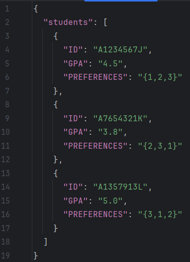
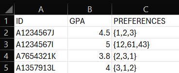
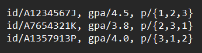

# User Guide

## Introduction

FindMySEP is a Command Line Interface (CLI) tool designed for admins handling the allocation of Student Exchange Program (SEP) locations for Computer Engineering (CEG) students at NUS. The app allows administrators to efficiently manage the allocation process using automated workflows and data-driven decision-making.

## Table of Contents
- [Quick Start](#quick-start)
- [Features](#features)
  - [Uploading Information](#uploading-information)
    - [Manual Input](#manual-input)
    - [File Input](#file-input)
  - [Add Command](#add-student-application-add)
  - [Help Command](#view-help-help)
  - [List Command](#print-current-student-list-list)
  - [Criteria Command](#set-minimum-gpa-criteria-minimum)
  - [Stats Command](#view-allocation-statistics-stats)
  - [ViewQuota Command](#view-remaining-quota-viewquota)
  - [Allocate Command](#run-allocation-algorithm-allocate)
  - [Revert Command](#revert-allocation-outcome-revert)
  - [Exit Command](#exit-program-bye-exit-quit)
- [FAQ](#faq)  
- [Command Summary](#command-summary)
- [Accepted File Format](#accepted-file-format)

## Quick Start

1. Ensure that you have Java 17 or above installed. ([Installation Guide](https://www.oracle.com/java/technologies/javase/jdk17-archive-downloads.html))
2. Download the latest version v2.0 of `FindOurSEP` from [here](https://github.com/AY2425S1-CS2113-W12-2/tp/releases).
3. **Copy the `.jar` file:**
   - Move the downloaded `.jar` file into a designated folder on your computer.
4. **Run the `.jar` file:**
   - Open a terminal.
   - Navigate (`cd`) to the folder containing the `.jar` file.
   - Execute the `.jar` file using the following command:
     ```shell
     java -jar FindOurSEP.jar
     ```

## Features

### Uploading Information
Upon start-up, the user will see this interface:
```bash
--------------------------------------------------------------------------------
Good day to you!
Before we begin, would you like to:
1. Manually input students data
2. Upload a file (.csv, .txt, .json)
Please choose 1 or 2 or exit :)
--------------------------------------------------------------------------------
```
The program provides two methods for uploading student data, allowing flexibility in how you input and manage information. Below are the options:


#### Manual Input
By inputting `1`, users can directly enter student data into the program. This option is useful for adding individual records or performing quick updates without needing to upload an entire file.

Subsequently, the user will be met with the following:
```shell
--------------------------------------------------------------------------------
Hi! Welcome to FindOurSEP! Enter 'help' for the list of commands.
--------------------------------------------------------------------------------
```
The user can then begin using the program by inputting [commands](#notes-about-the-command-format).

#### File Input
If `2` is chosen instead, the users will be asked to upload files in CSV, JSON, or TXT format, containing multiple student records at once. This method is ideal for batch processing, allowing efficient loading of extensive datasets into the program. Each file type follows a specific format for student ID, GPA, and university preferences, ensuring consistent and structured data handling.

Then, the user will be prompted to input the file path to the file.
```shell
--------------------------------------------------------------------------------
Please enter the ABSOLUTE path to the file: 
--------------------------------------------------------------------------------
```

If the file is uploaded successfully, the following will be displayed.
```shell
--------------------------------------------------------------------------------
File loaded successfully! Let's begin!
--------------------------------------------------------------------------------
```
However, if the file has any abnormality, an error message will be displayed to the user. The user will still be allowed to continue using the program but with no data uploaded. 

For e.g, the following is the error message shown when the user's CSV file contains data with wrong formatting.
```shell
A1234567I,5, {12,61,43}, ]" is not in correct format! 
Please ensure that you only have 3 columns representing the ID, GPA and PREFERENCES.
--------------------------------------------------------------------------------
Process error! Please ensure file is formatted correctly before retrying. You can continue to use the program.
--------------------------------------------------------------------------------
```
For further support, please take a look at [Accepted File Format](#accepted-file-format).

### *Notes about the command format:*
- Words in UPPER_CASE are the parameters to be supplied by the user.
- Extraneous parameters for commands that do not take in parameters (such as help, list and exit) will be ignored.
  - e.g. if the command specifies `help 123`, it will be interpreted as help.
- If you are using a PDF version of this document, be careful when copying and pasting commands that span multiple 
lines as space characters surrounding line-breaks may be omitted when copied over to the application.

### Add Student Application: `add`

Adds a student to the student list. `PREFERENCE_RANKINGS`  should be enclosed in curly braces. We allow students to have a preference of up to 3 universities, and they are ranked left to right, with the HIGHEST priority starting on the left.

Format: `add id/STUDENT_ID gpa/GPA p/{PREFERENCE_RANKINGS}`
e.g.
`add id/A1234567I gpa/5.0 p/{13,61,43}`


### View help: `help`
Shows a message explaining how to use the program. (Commands, etc.)  
Format: `help`

### Print current student list: `list`
Outputs a list of all current students in the student list.  
Format: `list`  
Example output:  

```shell
> list
--------------------------------------------------------------------------------
Here is the list:
┌───────────────┬──────────┬─────────────────────────┐
│    Student    │   GPA    │   Preference Rankings   │
├───────────────┼──────────┼─────────────────────────┤
│   A1234567I   │   5.0    │        13,61,43         │
│   A2113113X   │   4.99   │           61            │
└───────────────┴──────────┴─────────────────────────┘
--------------------------------------------------------------------------------
```
### Find Student: `find`
Finds the student with the keyword, returning either a list or report. Input is case-sensitive and 
full IDs are not required, but merely keyword.

Format: `find <list/report> STUDENT_ID`
e.g.
`find list A123`

Example output:

```shell
--------------------------------------------------------------------------------
Finding for students... student(s) found.
--------------------------------------------------------------------------------
--------------------------------------------------------------------------------
Here is the list:
┌───────────────┬──────────┬─────────────────────────┐
│    Student    │   GPA    │   Preference Rankings   │
├───────────────┼──────────┼─────────────────────────┤
│   A1234567I   │   5.0    │        13,61,43         │
│   A2113113X   │   4.99   │           61            │
└───────────────┴──────────┴─────────────────────────┘
--------------------------------------------------------------------------------
```

### Set minimum GPA criteria: `minimum`

This sets the minimum GPA for the cohort.

Format: `minimum GPA`
The student must achieve the same or a higher GPA to be considered for exchange. Any student below this GPA will not be allocated to any universities.
e.g.
`minimum 4.0`

### Filter Student: `filter`

Filters student data with a keyword, returning either a list or report.
User can choose between ascending/descending id/gpa and allocation status.

Format: `filter <list/report> <allocated/unallocated>`, 
        or `filter <list> <gpa/id> <ascending/descending>`
e.g. 
`filter list gpa ascending`

Example output:

```shell
--------------------------------------------------------------------------------
Here is the list:
┌───────────────┬──────────┬─────────────────────────┐
│    Student    │   GPA    │   Preference Rankings   │
├───────────────┼──────────┼─────────────────────────┤
│   A1237154B   │   4.50   │           64            │
│   A1234567I   │   5.0    │        13,61,43         │
└───────────────┴──────────┴─────────────────────────┘
--------------------------------------------------------------------------------
```

### View allocation statistics: ``stats``

Displays the average or minimum GPA for the specified partner university.  
Format: `stats -avggpa UNI_INDEX` or `stats -mingpa UNI_INDEX`   
Example output:  

```bash
> stats -avggpa 36
The average GPA for university index 36 (The University of Hong Kong) is: 3.80
```

### View remaining quota: ``viewQuota``

Displays the index, name, and remaining quota for the specified partner university. 
Format: `viewQuota UNI_INDEX`   
Example output:  

```bash
> viewQuota 
 Index: 58
 Name:  ETH Zurich
 Quota: 1
```

### Run allocation algorithm: ``allocate``

Start the allocation algorithm. It will allocate universities to the current student list based on each student's preferences and GPA.  
Format: `allocate`

### Revert allocation outcome: `revert`

Reverses the allocation algorithm. To be used when changes need to be made to the student list.  
Format: `revert`

### Exit Program: `bye`, `exit`, `quit`
When any of the exit commands (bye, exit, quit) are entered, the program will prompt the user (`Do you want to save your results?`) to save their allocation results. If the user choose `yes`, they will be prompted to enter the desired file format (CSV, JSON, TXT).
Based on their selection, the program will save the results in the specified format.

File Formats:
- CSV: Your data will be saved in a comma-separated values format, making it easy to open in spreadsheet applications.
- JSON: The data will be structured in a JSON format, suitable for data interchange and storage.
- TXT: Your results will be saved in a plain text format, which can be opened in any text editor.

Once the save operation is complete, the program will exit gracefully. 

If the user choose not to save the results, the program will end immediately without saving any data.

Below is an example of an `exit` scenario.
```shell
> exit
--------------------------------------------------------------------------------
Do you want to save your results?
--------------------------------------------------------------------------------
> yes
--------------------------------------------------------------------------------
Please choose a file type (CSV, JSON, TXT) to save your results.
--------------------------------------------------------------------------------
> json
Allocation results saved to JSON file at data/allocation_results.json
--------------------------------------------------------------------------------
Adios, amigo!
--------------------------------------------------------------------------------
```

## FAQ

## Frequently Asked Questions (FAQs)

> **Q: I am facing trouble starting the application. Do you know what might be the issue?**
>
> A: Please ensure that you have Java 17 or above installed on your machine. You may find more instructions in the [Quick Start](#quick-start) section.

> **Q: How do I know whether the data entered is saved?**
>
> A: Your data is safely stored in the `data` folder located in the folder where your jar file is. The file will be named `allocation_results` with the extension you selected before the application closed.

> **Q: My application crashed. How do I report the problem to the developers?**
>
> A: We are sorry for the unpleasant experience with FindOurSEP, and we would be more than happy to solve the issue. You may file an issue on our [GitHub](https://github.com/AY2425S1-CS2113-W12-2/tp/issues) stating how you arrived at the problem, so that our developers can assist you with the issue.

> **Q: I am a developer. How can I find the source code and contribute to FindOurSEP?**
>
> A: FindOurSEP is an open-source application, and we welcome developers to share their ideas. You may find the source code on [GitHub](https://github.com/AY2425S1-CS2113-W12-2/tp).

## Command Summary

| Action    | Format/Example                                                                                                                          |
|-----------|-----------------------------------------------------------------------------------------------------------------------------------------|
| Add       | `add id/STUDENT_ID gpa/GPA p/{PREFERENCE_RANKINGS}` <br> e.g. `add id/A1234567I gpa/5.0 p/{13,61,43}`                                   |
| Delete    | `delete STUDENT_ID` <br> e.g. `delete A1234567I`                                                                                        |
| Find      | `find <list/report> STUDENT_ID` <br> e.g. `find list A1234567I`                                                                         |
| Filter    | `filter <list/report> <allocated/unallocated>` or `filter <list> <gpa/id> <ascending/descending>`<br/> e.g. `filter list gpa ascending` |
| List      | `list`                                                                                                                                  |
| Statistic | ``stats -avggpa UNI_INDEX``  or ``stats -mingpa UNI_INDEX`` <br> e.g. ``stats -mingpa 42``                                              |
| viewQuota | ``viewQuota UNI_INDEX`` <br> e.g. ``viewQuota 42``                                                                                      |
| Allocate  | `allocate`                                                                                                                              |
| Minimum   | `minimum 4.0`                                                                                                                           |
| Revert    | `revert`                                                                                                                                |
| GetReport | `generate`                                                                                                                              |
| Exit      | `bye`, `exit`, `quit`                                                                                                                   |
| Help      | `help`                                                                                                                                  |

## Accepted File Format
The program supports files input in `.JSON`, `.CSV`, and `.TXT` formats.

Please make sure your file matches one of these formats:
### JSON:


### CSV:


### TXT:


Feel free to use the test.csv, test.json and test.txt files available in [v2.0](https://github.com/AY2425S1-CS2113-W12-2/tp/releases) for testing.
